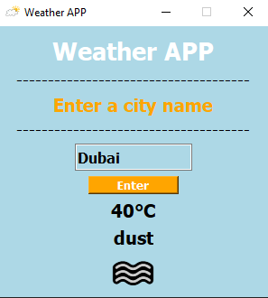

# Weather Application

A sleek and simple desktop weather application built with Python and PyQt6. It fetches real-time weather data from the OpenWeatherMap API and displays it with an intuitive graphical interface.


## ✨ Features

*   **Real-time Data**: Get current weather conditions for any city worldwide.
*   **Clean GUI**: User-friendly interface built with PyQt6.
*   **Visual Feedback**: Weather conditions are represented with emojis for quick recognition.
*   **Error Handling**: Gracefully handles invalid city names and network issues.
*   **Metric Units**: Temperature is displayed in Celsius.

## 📸 Screenshot



## 🛠️ Requirements

Before running the application, ensure you have the following installed:

*   Python 3.x
*   The required Python libraries listed in `requirements.txt`.

## 📦 Installation & Setup

1.  **Clone the repository** (or download the source files):
    ```bash
    git clone https://github.com/GitUseHubber/WeatherApp.git
    cd weather-app
    ```

2.  **Install the dependencies**:
    It is recommended to use a virtual environment. Install the required packages using pip:
    ```bash
    pip install -r requirements.txt
    ```
    *Alternatively, install them manually:*
    ```bash
    pip install requests PyQt6
    ```

3.  **Get an API Key**:
    *   Sign up for a free account at [OpenWeatherMap](https://home.openweathermap.org/users/sign_up).
    *   Navigate to the [API Keys](https://home.openweathermap.org/api_keys) section.
    *   Copy your default key or generate a new one.

4.  **Configure the API Key**:
    *   Open the `weather_app.py` file.
    *   Find the line `api_key = "YOUR_API_KEY_HERE"`.
    *   Replace the placeholder text with your actual API key.
    ```python
    api_key = "1234567890abcdef" # Your actual key here
    ```

5.  **Place the Icon**:
    *   Ensure the `iconImage.png` file is in the same directory as `weather_app.py`.

## 🚀 Usage

1.  Run the application from the command line:
    ```bash
    python weather_app.py
    ```
2.  Enter the name of a city in the text input field.
3.  Click the "Enter" button or press the Return key.
4.  View the current temperature, weather description, and corresponding emoji.

## 🗂️ Project Structure
weather-app/
├── weather_app.py # Main application script
├── iconImage.png # Application window icon
├── AppCapture.PNG # Screenshot of the app
└── README.md # This file


## 🧩 Code Overview

### Main Class: `AppWindow(QWidget)`

The main application window class handling the UI and logic.

*   **`__init__(self)`**: Initializes the window, sets its properties (title, icon, size), and creates all UI widgets (labels, input field, button).
*   **`get_display_data(self)`**: The slot method connected to the "Enter" button. It fetches data from the OpenWeatherMap API, parses the JSON response, and updates the UI labels. It also includes error handling for invalid cities.
*   **`emojiUpdate(self, condition_id)`**: Maps OpenWeatherMap condition IDs to representative emojis.
*   **`descriptionUpdate(self, desc)`**: Updates the weather description label.

### API Integration

The application constructs a request URL using the user-provided city name and the API key:
```python
url = f"https://api.openweathermap.org/data/2.5/weather?q={city_name}&appid={api_key}"
